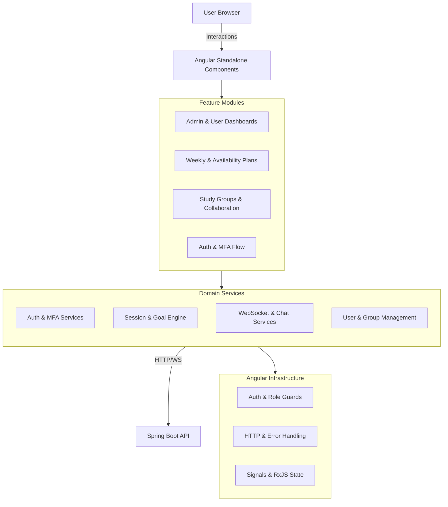

 <a href="#">
    
  </a>

  <h1>Cadence Platform - Frontend UI</h1>
  <p><strong>Interactive Study Dashboard | Smart Plan Visualization | Real-time Collaboration | Responsive Design</strong></p>

  <div>
    
    
    
    
    
    
  </div>

</div>

---

## Overview

**EduSync Frontend** is a modern, high-performance web application built with **Angular 21** and **Tailwind CSS 4**. It provides students with an intuitive interface to manage their academic journey, visualize smart study plans, and collaborate in real-time.

The application leverages **RxJS** for reactive state management, **STOMP/WebSockets** for live communication, and a component-based architecture powered by **Spartan UI** (shadcn/ui port for Angular) to deliver a seamless user experience.

---

## Getting Started

Follow these steps to set up the development environment and run the application.

### 1. Prerequisites

Ensure you have the following installed:
*   **Node.js** (v20 or higher)
*   **npm** (v10 or higher)
*   **Angular CLI** (v21+)

### 2. Installation

1.  Clone the repository:
    ```bash
    git clone <repository-url>
    cd study-platform-frontend
    ```
2.  Install dependencies:
    ```bash
    npm install
    ```

### 3. Environment Configuration

The application expects a backend API. You can configure the API URL in `src/app/environments/environment.ts`:

```typescript
export const environment = {
  production: false,
  apiUrl: 'http://localhost:8080', // Point to your backend instance
};
```

### 4. Running the Application

```bash
# Start the development server
npm start
```

The application will be available at `http://localhost:4200`.

---

## Architecture and Design

The frontend follows a layered architecture with a clear separation between UI features, domain logic (Core Services), and infrastructure (Interceptors/Guards).



<div align="center">

| Concept | Implementation Strategy |
| :--- | :--- |
| **State Management** | Angular Signals (Component) + RxJS (Global) |
| **Security** | RBAC Guards + JWT Interceptors + MFA Flow |
| **Communication** | REST API + WebSocket STOMP (RxStomp) |
| **UI System** | Spartan UI (shadcn/ui) + Tailwind CSS 4 |

</div>

---

## Project Structure

The project is structured to separate core business logic from UI presentation and reusable primitive components.

```text
src/
├── app/
│   ├── core/           # Services, Models, Guards, Interceptors
│   ├── components/     # Domain components (Admin, User, Shared)
│   ├── layouts/        # Structural shells (Main, SideBar)
│   ├── pages/          # Routed top-level components
│   └── environments/   # Environment configurations
└── components/ui/      # Reusable UI Primitives (Spartan UI/shadcn)
```

---

## Key Features

*   **Interactive Dashboard:** Real-time overview of study progress, upcoming sessions, and recent activities.
*   **Smart Plan Visualization:** Dynamic weekly planners and availability managers.
*   **Collaborative Groups:** Real-time group chat and shared session management via WebSockets.
*   **Admin Suite:** Comprehensive management of users, groups, and platform-wide analytics.
*   **Secure Authentication:** Multi-factor authentication (MFA) flows and role-based access control (RBAC).
*   **Advanced Analytics:** Data visualization using ECharts for performance tracking.

---

## Documentation and Testing

### Component Development
Components are built using **Spartan UI** (shadcn/ui port). Check `src/app/components/ui` for primitive components.

### Running Tests
The project uses **Vitest** for unit testing.
```bash
# Run tests
npm test

# Run tests with coverage
npm test -- --coverage
```

---

## License
This project is licensed under the MIT License - see the [LICENSE](LICENSE) file for details.

<hr />

<div align="center">
  <p>Cadence Platform - Frontend UI</p>
</div>
